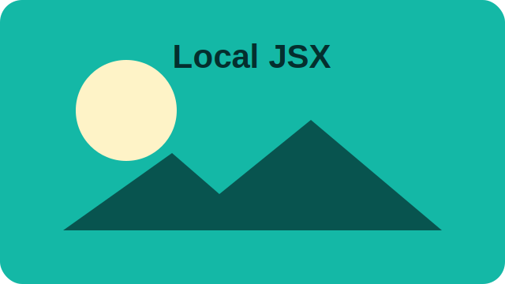
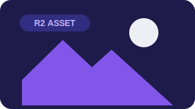

---
title: Local JSX Image
layout: media
---

# Media verification

Local JSX image paths are rewritten to generated public asset URLs.

---
title: R2-backed Image
layout: media
---

# R2-backed image

The generated asset URL renders locally and can be served from an R2 binding with long-lived cache headers.

---
title: YouTube Embed
layout: media
---

# YouTube embed

@[youtube](https://www.youtube.com/watch?v=dQw4w9WgXcQ)

Zenn-style shorthand compiles to the built-in `EmbedFrame`.

---
title: Generic Embed
layout: media
---

# Generic iframe

@[embed](https://example.com/embed/status)

Generic iframe embeds use the same package defaults.

https://example.com/plain-link

---
title: X Post Embed
layout: media
---

# X post embed

@[x](https://x.com/honojs/status/1659577874821836801?s=20)

`@[x]` renders the official post embed markup by default.

---
title: Link Card
layout: media
---

# Link card

https://yusukebe.com/

@[card](https://yusukebe.com/)

Link cards resolve OGP metadata at compile time when available and stay script-free at runtime.
